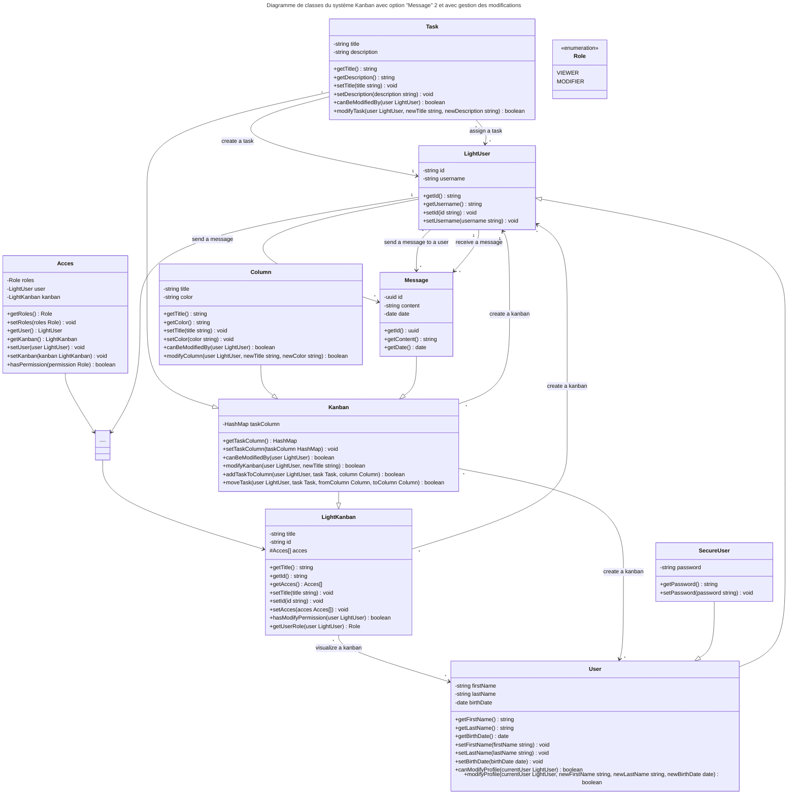

Init
# Diagramme de classes du système Kanban avec option "Message" 1 et sans gestion des modifications
```mermaid
---
title: Diagramme de classes du système Kanban avec option "Message" 1 et avec gestion des modifications
---
classDiagram

class Task {
    -string title
    -string description
    +getTitle() string
    +getDescription() string
    +setTitle(title string) void
    +setDescription(description string) void
    +canBeModifiedBy(user LightUser) boolean
    +modifyTask(user LightUser, newTitle string, newDescription string) boolean
}

class Message {
    -uuid id
    -string content
    -date date
    +getId() uuid
    +getContent() string
    +getDate() date
}

class Column {
    -string title
    -string color
    +getTitle() string
    +getColor() string
    +setTitle(title string) void
    +setColor(color string) void
    +canBeModifiedBy(user LightUser) boolean
    +modifyColumn(user LightUser, newTitle string, newColor string) boolean
}

class Chat {
}

class LightKanban {
    -string title
    -string id
    #Acces[] acces
    +getTitle() string
    +getId() string
    +getAcces() Acces[]
    +setTitle(title string) void
    +setId(id string) void
    +setAcces(acces Acces[]) void
    +hasModifyPermission(user LightUser) boolean
    +getUserRole(user LightUser) Role
}

class Kanban {
    -HashMap taskColumn
    +getTaskColumn() HashMap
    +setTaskColumn(taskColumn HashMap) void
    +canBeModifiedBy(user LightUser) boolean
    +modifyKanban(user LightUser, newTitle string) boolean
    +addTaskToColumn(user LightUser, task Task, column Column) boolean
    +moveTask(user LightUser, task Task, fromColumn Column, toColumn Column) boolean
}

class SecureUser {
    -string password
    +getPassword() string
    +setPassword(password string) void
}

class User {
    -string firstName
    -string lastName
    -date birthDate
    +getFirstName() string
    +getLastName() string
    +getBirthDate() date
    +setFirstName(firstName string) void
    +setLastName(lastName string) void
    +setBirthDate(birthDate date) void
    +canModifyProfile(currentUser LightUser) boolean
    +modifyProfile(currentUser LightUser, newFirstName string, newLastName string, newBirthDate date) boolean
}

class LightUser {
    -string id
    -string username
    +getId() string
    +getUsername() string
    +setId(id string) void
    +setUsername(username string) void
}

class Role {
    <<enumeration>>
    VIEWER
    MODIFIER
}

class Acces {
    -Role roles
    -LightUser user
    -LightKanban kanban
    +getRoles() Role
    +setRoles(roles Role) void
    +getUser() LightUser
    +getKanban() LightKanban
    +setUser(user LightUser) void
    +setKanban(kanban LightKanban) void
    +hasPermission(permission Role) boolean
}

%% Relationships
Task "*" --> "1" LightUser : create a task
Task "*" --> "*" LightUser : assign a task

LightKanban "*" --> "*" LightUser : create a kanban
LightKanban "*" --> "*" User : visualize a kanban
LightKanban ||..|| Acces : association

Kanban "*" --> "1" LightUser : create a kanban
Kanban "*" --> "*" User : create a kanban

%% Inheritance
Kanban --|> LightKanban
Chat --|> Kanban
User --|> LightUser
SecureUser --|> User
Message --|> Chat
Task --|> Kanban
Column --|> Kanban

%% Message relationships
LightUser "1" --> "*" Message : send a message
LightUser "*" --> "*" Chat : participate to a chat
```

# Diagramme de classes du système Kanban avec option "Message" 2 et sans gestion des modifications

