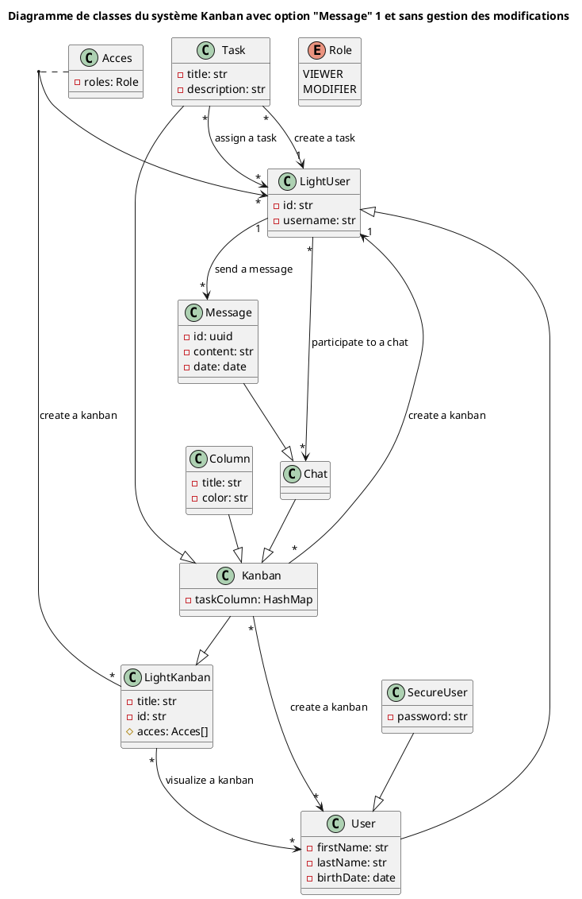
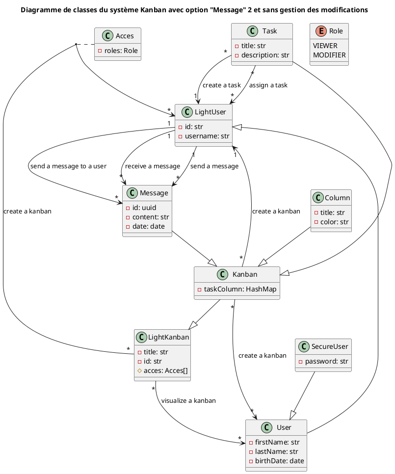

Init
# Diagramme de classes du système Kanban avec option "Message" 1 et sans gestion des modifications

# Diagramme de classes du système Kanban avec option "Message" 2 et sans gestion des modifications

