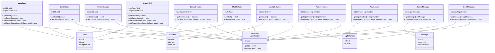

```mermaid
classDiagram
    title Kanban System Modifications Class Diagram

    %% ===============================
    %% REFERENCE CLASSES
    %% ===============================
    class Task {
        - id: uuid
        - title: str
        - description: str
    }

    class Column {
        - id: uuid
        - title: str
        - color: str
    }

    class LightKanban {
        - title: str
        - id: uuid
    }

    class Message {
        - id: uuid
        - content: str
        - date: datetime
    }

    %% ===============================
    %% ABSTRACT BASE CLASS
    %% ===============================
    class Modification {
        <<abstract>>
        - id: uuid
        + getId(): uuid
        + setId(id: uuid): void
    }

    %% ===============================
    %% MODIFICATION SUBCLASSES
    %% ===============================
    class ModifyTask {
        - task: Task
        + getTask(): Task
        + setTask(task: Task): void
    }

    class ModifyColumn {
        - column: Column
        + getColumn(): Column
        + setColumn(column: Column): void
    }

    class RemoveAccess {
        - lightKanban: LightKanban
        + getLightKanban(): LightKanban
        + setLightKanban(lightKanban: LightKanban): void
    }

    class AddAccess {
        - lightKanban: LightKanban
        + getLightKanban(): LightKanban
        + setLightKanban(lightKanban: LightKanban): void
    }

    class CreateColumn {
        - newColumn: Column
        + getNewColumn(): Column
        + setNewColumn(newColumn: Column): void
    }

    class DeleteColumn {
        - columnId: uuid
        + getColumnId(): uuid
        + setColumnId(columnId: uuid): void
    }

    class ModifyKanban {
        - kanban: LightKanban
        + getKanban(): LightKanban
        + setKanban(kanban: LightKanban): void
    }

    class CreateTask {
        - newTask: Task
        - targetColumn: uuid
        + getNewTask(): Task
        + getTargetColumn(): uuid
        + setNewTask(newTask: Task): void
        + setTargetColumn(targetColumn: uuid): void
    }

    class DeleteTask {
        - taskId: uuid
        + getTaskId(): uuid
        + setTaskId(taskId: uuid): void
    }

    class MoveTask {
        - taskId: uuid
        - targetColumn: uuid
        + getTaskId(): uuid
        + getTargetColumn(): uuid
        + setTaskId(taskId: uuid): void
        + setTargetColumn(targetColumn: uuid): void
    }

    class CreateMessage {
        - message: Message
        + getMessage(): Message
        + setMessage(message: Message): void
    }

    %% ===============================
    %% INHERITANCE RELATIONSHIPS
    %% ===============================
    ModifyTask --|> Modification
    ModifyColumn --|> Modification
    ModifyKanban --|> Modification
    CreateTask --|> Modification
    CreateColumn --|> Modification
    DeleteTask --|> Modification
    DeleteColumn --|> Modification
    MoveTask --|> Modification
    CreateMessage --|> Modification
    AddAccess --|> Modification
    RemoveAccess --|> Modification

    %% ===============================
    %% ASSOCIATION RELATIONSHIPS
    %% ===============================
    ModifyTask " * " -- " 1 " Task
    ModifyColumn " * " -- " 1 " Column
    ModifyKanban " * " -- " 1 " LightKanban
    CreateTask " 1 " -- " 1 " Task
    CreateColumn " 1 " -- " 1 " Column
    CreateMessage " 1 " -- " 1 " Message
    DeleteTask " 1 " -- " 1 " Task
    DeleteColumn " 1 " -- " 1 " Column
    MoveTask " * " -- " 1 " Task
    AddAccess " * " -- " 1 " LightKanban
    RemoveAccess " * " -- " 1 " LightKanban
```
